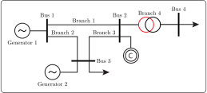

# [Power System Test Case](@id PowerSystemTestCaseExamples)
The power system shown in Figure 1 will serve as an example to demonstrate various features of JuliaGrid related to heterogeneous steady-state analyses and the straightforward implementation of quasi-steady-state analysis. Specifically, we will conduct multiple steady-state analyses throughout all examples to illustrate JuliaGrid’s ability to seamlessly accommodate changes in power system parameters or measurement data.

```@raw html

<figcaption>Figure 1: The 4-bus power system.</figcaption>
&nbsp;
```

To begin, we will use the minimal data necessary to define the power system model:
```@example 4bus
using JuliaGrid, JuMP, Ipopt # hide
@default(template) # hide
@default(unit) # hide

system = powerSystem()

addBus!(system; label = "Bus 1")
addBus!(system; label = "Bus 2")
addBus!(system; label = "Bus 3")
addBus!(system; label = "Bus 4")

addBranch!(system; label = "Branch 1", from = "Bus 1", to = "Bus 2", reactance = 0.06)
addBranch!(system; label = "Branch 2", from = "Bus 1", to = "Bus 3", reactance = 0.22)
addBranch!(system; label = "Branch 3", from = "Bus 2", to = "Bus 3", reactance = 0.19)
addBranch!(system; label = "Branch 4", from = "Bus 2", to = "Bus 4", reactance = 0.32)

addGenerator!(system; label = "Generator 1", bus = "Bus 1")
addGenerator!(system; label = "Generator 2", bus = "Bus 3")

nothing # hide
```

The power system is initially modeled by defining four buses, two generators, and four branches with their respective reactance values. As we progress through different analyses, additional parameters relevant to specific types of power system analyses will be incorporated incrementally. Using functions to update data for buses, branches, and generators later, rather than defining all parameters upfront, is intended to provide step-by-step examples. This approach highlights JuliaGrid’s flexibility and usability, offering a clear demonstration of how the system can be gradually adapted to meet various analysis needs.

