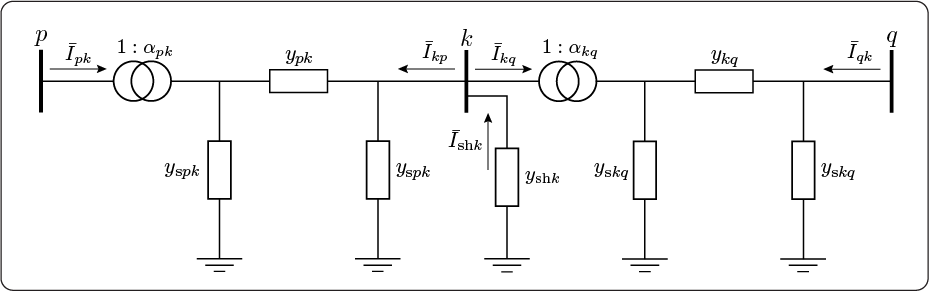

# [Network Equations](@id networkequationpage)
Network equations obtained using the unified branch model and defined below represent the basic setup used for the power system analysis. The power system network topology is usually described by the bus/branch model, where branches of the network are defined using the two-port ``\pi``-model. The bus/branch model can be represented using a graph ``\mathcal{G} =(\mathcal{H},\mathcal{E})``, where the set of nodes ``\mathcal{H} = \{1,\dots,n  \}`` represents the set of buses, while the set of edges ``\mathcal{E} \subseteq \mathcal{H} \times \mathcal{H}`` represents the set of branches of the power network, shown in Figure 1.

```@raw html

<figcaption>Figure 1: An example of the power system bus/branch model.</figcaption>
```

---

## [Branch Model](@id branchmodel)
The equivalent unified ``\pi``-model for a branch, shown in Figure 2, is sufficient to describe all main equations related to the power system.
```@raw html

<figcaption>Figure 2: The equivalent branch model, where transformer is located at "from bus end" of the branch.</figcaption>
&nbsp;
```

In Figure 1, ``\{i,j\} \in \mathcal{H}`` denotes buses, where, in power networks the bus represents elements such as a generator, load, substation, etc. The branch series admittance ``y_{ij}`` is inversely proportional to the branch series impedance ``z_{ij}``:  
```math
    y_{ij} = \frac{1}{z_{ij}} =
    \frac{1}{{r_{ij}} + \text{j}x_{ij}} =
    \frac{r_{ij}}{r_{ij}^2 + x_{ij}^2} - \text{j}\frac{x_{ij}}{r_{ij}^2 + x_{ij}^2} = g_{ij} + \text{j}b_{ij},
```
where ``r_{ij}`` is a resistance, ``x_{ij}`` is a reactance, ``g_{ij}`` is a conductance and ``b_{ij}`` is a susceptance of the branch. We denote a half of the total branch shunt admittance (i.e., charging admittance) as ``y_{\text{s}ij}`` and ``y_{\text{s}ji}``, where it can be written:
```math
y_{\text{s}ij} = y_{\text{s}ji} = \text{j} b_{\text{s}i} = \text{j} b_{\text{s}j}.

```

The transformer complex ratio ``\alpha_{ij}`` is defined:
```math
    \alpha_{ij} = \cfrac{1}{\tau_{ij}}e^{-\text{j}\phi_{ij}},
```
where ``\tau_{ij}`` is the transformer tap ratio magnitude, while ``\phi_{ij}`` is the transformer phase shift angle, always located "from bus end" of the branch.

Using Kirchhoff's circuit laws, **the unified branch model** can be described by complex expressions:
```math
  \begin{bmatrix}
    \bar{I}_{ij} \\ \bar{I}_{ji}
  \end{bmatrix} =
  \begin{bmatrix}
    \cfrac{1}{\tau_{ij}^2}({y}_{ij} + y_{\text{s}ij}) & -\alpha_{ij}^*{y}_{ij}\\
    -\alpha_{ij}{y}_{ij} & {y}_{ij} + y_{\text{s}ij}
  \end{bmatrix}  
  \begin{bmatrix}
    \bar{V}_{i} \\ \bar{V}_{j}
  \end{bmatrix}.    
```  
Each branch ``(i,j) \in \mathcal{E}`` can be described with four parameters ``C_{ij}``, ``D_{ij}``, ``E_{ij}`` and ``F_{ij}``, where the unified branch model is:
```math
  \begin{bmatrix}
    \bar{I}_{ij} \\ \bar{I}_{ji}
  \end{bmatrix} =
  \begin{bmatrix}
    C_{ij} & D_{ij}\\
    E_{ij} & F_{ij}
  \end{bmatrix}  
  \begin{bmatrix}
    \bar{V}_{i} \\ \bar{V}_{j}
  \end{bmatrix}.    
```

Consequently, if ``\tau_{ij} = 1`` and ``\phi_{ij} = 0`` the model describes the line. In-phase transformers are defined if ``\phi_{ij} = 0`` and ``y_{\text{s}ij} = 0``, while phase-shifting transformers are obtained if ``y_{\text{s}ij} = 0``.

---

## [Nodal Admittance Matrix](@id injectionnodal)
Let us consider an example, given in Figure 3, that will allow us an easy transition to the general case. We observe system with three buses and two branches, where the bus ``k`` is incident to the shunt element.
```@raw html

<figcaption>Figure 3: The example with three buses and two branches.</figcaption>
&nbsp;
```

JuliaGrid uses the input data where the bus incident to the transformer is always located at "from bus end", and accordingly, we denote other elements related to branches, as given in Table.

| From Bus  | To Bus  | Admittance  | Shunt Admittance    | Transformer Ratio  |
|:---------:|:-------:|:-----------:|:-------------------:|:------------------:|	 
| ``p``     | ``k``   | ``y_{pk}``  | ``y_{\text{s}pk}``  | ``\alpha_{pk}``    |
| ``k``     | ``q``   | ``y_{kq}``  | ``y_{\text{s}kq}``  | ``\alpha_{kq}``    |

Before we proceed further, it would be helpful to observe sets related to the system that we use in the rest of this part:
* set of buses: ``\mathcal{H} = \{p,k,q\}``;
* set of branches: ``\mathcal{E} = \{(p,k), (k,q)\}``.

According to the [unified branch model](@ref branchmodel) each branch is described using the system of equations as follows:
```math
  \begin{bmatrix}
    \bar{I}_{pk} \\ \bar{I}_{kp}
  \end{bmatrix} =
  \begin{bmatrix}
    C_{pk} & D_{pk}\\
    E_{pk} & F_{pk}
  \end{bmatrix}  
  \begin{bmatrix}
    \bar{V}_{p} \\ \bar{V}_{k}
  \end{bmatrix}   
```
```math
  \begin{bmatrix}
    \bar{I}_{kq} \\ \bar{I}_{qk}
  \end{bmatrix} =
  \begin{bmatrix}
    C_{kq} & D_{kq}\\
    E_{kq} & F_{kq}
  \end{bmatrix}  
  \begin{bmatrix}
    \bar{V}_{k} \\ \bar{V}_{q}
  \end{bmatrix}.    
```

The injection complex currents into buses are:
```math
  \begin{aligned}
    \bar{I}_{p} &= \bar{I}_{pk} = C_{pk} \bar{V}_{p} + D_{pk} \bar{V}_{k} \\
    \bar{I}_{k} &= \bar{I}_{kp} + \bar{I}_{kq} - \bar{I}_{\text{sh}k} = E_{pk} \bar{V}_{p} + F_{pk} \bar{V}_{k} + C_{kq} \bar{V}_{k} + D_{kq} \bar{V}_{q} + {y}_{\text{sh}k} \bar{V}_k \\
    \bar{I}_{q} &= \bar{I}_{qk} = E_{kq} \bar{V}_{k} + F_{kq} \bar{V}_{q},
  \end{aligned}
```
The system of equations can be written in the matrix form:
```math
  \begin{bmatrix}
    \bar{I}_{p} \\ \bar{I}_{k} \\ \bar{I}_{q}
  \end{bmatrix} =
  \begin{bmatrix}
    C_{pk} & D_{pk} & 0 \\
    E_{pk} & C_{kq} + F_{pk} + {y}_{\text{sh}k}  & D_{kq} \\
    0 & E_{kq} & F_{kq}
  \end{bmatrix}
  \begin{bmatrix}
    \bar{V}_{p} \\ \bar{V}_{k} \\ \bar{V}_{q}
  \end{bmatrix}.
```

Next, the system of equations for buses ``i=1, \dots, n`` can be written in the matrix form:
```math
  \mathbf {\bar {I}} = \mathbf{Y} \mathbf {\bar {V}},
```
where:
* ``\mathbf {\bar {I}} \in \mathbb{C}^{n}`` is the vector of injection complex currents with elements ``\bar{I}_i,\;i=1,\dots,n``;
* ``\mathbf {\bar {V}} \in \mathbb{C}^{n}`` is the vector of bus complex voltages with elements ``\bar{V}_i,\;i=1,\dots,n``;
* ``\mathbf{Y} = \mathbf{G} + \text{j}\mathbf{B} \in \mathbb{C}^{n \times n}`` is the **bus or nodal admittance matrix**, where:
  * the diagonal elements are equal to:
    ```math
    Y_{ii} = G_{ii} + \text{j}B_{ii} =
    \sum\limits_{e \in \mathcal{E}, \; e(1) = i} C_{e} + \sum\limits_{e \in \mathcal{E}, \; e(2) = i} F_{e} + {y}_{\text{sh}i},  \;\;\; i \in \mathcal{H},
    ```
  * the strictly upper triangular part contains elements equal to:
    ```math
    Y_{ij} = G_{ij} + \text{j}B_{ij} = D_{e}, \;\;\;  e \in \mathcal{E},\;  i = e(1),\;  j = e(2),
    ```
  * the strictly lower triangular part contains elements equal to:
    ```math
    Y_{ij} = G_{ij} + \text{j}B_{ij} = E_{e}, \;\;\;  e \in \mathcal{E},\;  i = e(2),\;  j = e(1).
    ```

When a branch is not incident (or adjacent) to a bus the corresponding element in the nodal admittance matrix ``\mathbf{Y}`` is equal to zero. The nodal admittance matrix ``\mathbf{Y}`` is a sparse matrix (i.e., a small number of elements are non-zeros) for real-world power systems. Although it is often assumed that the matrix ``\mathbf{Y}`` is symmetrical, it is not a general case, for example, in the presence of phase shifting transformers the matrix ``\mathbf{Y}`` is not symmetrical [[1, Sec. 9.6]](@ref refsbranch).

---

## [Injection Power](@id injectionpower)
The **apparent power injection** ``S_i`` into the bus ``i`` is a function of the complex voltage ``\bar{V}_i`` at the bus ``i`` and the conjugate value of the injection complex current ``\bar{I}_i`` into the bus ``i``:
```math
  {S}_{i} =\bar{V}_{i}\bar{I}_{i}^* = P_i + \text{j}Q_i,
```
where ``P_i`` and ``Q_i`` represent active power and reactive power injection into the bus ``i``. Thus, apparent injection power ``S_i`` into the bus ``i`` is:
```math
  {S}_{i} = \bar{V}_{i}\sum\limits_{j \in \mathcal{H}_i} {Y}_{ij}^* \bar{V}_{j}^*,                  
```
where ``\mathcal{H}_i`` contains buses incident to the bus ``i``, including bus ``i``.

Without loss of generality, we can discard the observed set ``\mathcal{H}_i`` and observe the entire bus set, where the corresponding elements of the nodal admittance matrix ``\mathbf{Y}``  are equal to zero if the buses are not adjacent. Then, using the polar representation for bus voltages, apparent injection power ``S_i`` is defined:
```math
  {S}_{i} ={V}_{i}\sum\limits_{j = 1}^n {V}_{j} \text{e}^{\text{j}\theta_{ij}}(G_{ij} - \text{j}B_{ij}),   
```
where ``\theta_{ij}=\theta_{i}-\theta_{j}`` is the voltage angle difference between buses ``i`` and ``j``. Thus, the **active and reactive injection power** into the bus ``i`` are equal to:
```math
  \begin{aligned}
    {P}_{i} &={V}_{i}\sum\limits_{j=1}^n {V}_{j}(G_{ij}\cos\theta_{ij} + B_{ij}\sin\theta_{ij})\\
    {Q}_{i} &={V}_{i}\sum\limits_{j=1}^n {V}_{j}(G_{ij}\sin\theta_{ij} - B_{ij}\cos\theta_{ij}).     
	\end{aligned}
```
These equations represent a hybrid form which is a common form for solving power flow problems [[2]](@ref refsbranch).

---

## [References](@id refsbranch)
[1] J. Grainger and W. Stevenson, Power system analysis, ser. McGraw-Hill series in electrical and computer engineering: Power and energy. McGraw-Hill, 1994.

[2] A. Wood and B. Wollenberg, Power Generation, Operation, and Control, ser. A Wiley-Interscience publication. Wiley, 1996.
