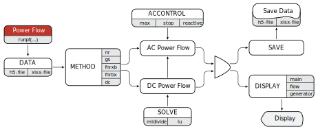

##  Power Flow

The function runs the AC and DC power flow analysis, with support for the reactive power constraints.

The AC power flow analysis includes four different algorithms:
 - Newton-Raphson,
 - Gauss-Seidel,
 - XB fast decoupled Newton-Raphson,
 - BX fast decoupled Newton-Raphson.
---

## Run Settings

Input arguments of the function `runpf(...)` describe the power flow settings. The order of inputs and their appearance is arbitrary, with only DATA input required. Still, for the methodological reasons, the syntax examples follow a certain order.

#### Syntax
```julia-repl
runpf(DATA, METHOD)
runpf(DATA, METHOD, DISPLAY)
runpf(DATA, METHOD, DISPLAY; ACCONTROL)
runpf(DATA, METHOD, DISPLAY; ACCONTROL, SOLVE)
runpf(DATA, METHOD, DISPLAY; ACCONTROL, SOLVE, SAVE)
```

#### Description
```julia-repl
runpf(DATA, METHOD) solves power flow problem
runpf(DATA, METHOD, DISPLAY) shows results in the terminal
runpf(DATA, METHOD, DISPLAY; ACCONTROL) sets variables for the AC power flow
runpf(DATA, METHOD, DISPLAY; ACCONTROL, SOLVE) sets the linear system solver
runpf(DATA, METHOD, DISPLAY; ACCONTROL, SOLVE, SAVE) exports results
```

#### Output
```julia-repl
results = runpf(...) returns results of the power flow analysis
```

####  Examples
```julia-repl
julia> results = runpf("case14.h5", "nr", "main", "flow", "generator")
```
```julia-repl
julia> results = runpf("case14.xlsx", "nr", "main"; max = 10, stop = 1.0e-8)
```
```julia-repl
julia> results = runpf("case14.h5", "gs", "main"; max = 500, stop = 1.0e-8, reactive = 1)
```
```julia-repl
julia> results = runpf("case14.h5", "dc"; solve = "lu", save = "D:/case14results.xlsx")
```
---

## Input Arguments

The power flow function `runpf(...)` receives a group of variable number of arguments: DATA, METHOD, DISPLAY, and group of arguments by keyword: ACCONTROL, SOLVE, SAVE.

#### Variable Arguments

DATA

| Example           | Description                                    |
|:------------------|:-----------------------------------------------|
|`"case14.h5"`      | loads the power system data from the package   |
|`"case14.xlsx"`    | loads the power system data from the package   |
|`"C:/case14.xlsx"` | loads the power system data from a custom path |

METHOD

| Command | Description
|:--------|:---------------------------------------------------------------------------------|
|`"nr"`   | runs the AC power flow analysis using Newton-Raphson algorithm, `default setting`|
|`"gs"`   | runs the AC power flow analysis using Gauss-Seidel algorithm                     |
|`"fnrxb"`| runs the AC power flow analysis using XB fast Newton-Raphson algorithm           |
|`"fnrbx"`| runs the AC power flow analysis using BX fast Newton-Raphson algorithm           |
|`"dc"`   | runs the DC power flow analysis                                                  |

DISPLAY

| Command     | Description                    |
|:------------|:-------------------------------|
|`"main"`     | shows main bus data display    |
|`"flow"`     | shows power flow data display  |
|`"generator"`| shows generator data display   |
----

#### Keyword Arguments

ACCONTROL

| Command      | Description                                                                              |
|:-------------|:-----------------------------------------------------------------------------------------|
|`max = value` | specifies the maximum number of iterations for the AC power flow, `default setting: 100` |
|`stop = value`| specifies the stopping criteria for the AC power flow, `default setting: 1.0e-8`         |
|`reactive = 1`| forces reactive power constraints, `default setting: 0`                                  |

SOLVE

| Command            | Description                                      |
|:-------------------|:-------------------------------------------------|
|`solve = "builtin"` | built-in linear system solver, `default setting` |
|`solve = "lu"`      | LU linear system solver                          |

SAVE

| Command                 | Description                    |
|:------------------------|:-------------------------------|
|`save = "path/name.h5"`  | saves results in the h5-file   |
|`save = "path/name.xlsx"`| saves results in the xlsx-file |
---

## Input Data Structure

The function supports two input types `.h5` or `.xlsx` file extensions, with variables `bus`, `generator`, `branch`, and `basePower`, and uses the same data format as Matpower, except for the first column in the `branch` data.

The instance of the data structure requires minimum a `bus` and `branch` data information to run the module.

We define the system base power in MVA using `basePower`. Next, we describe the structure of other variables involved in the input DATA.

The `bus` data structure

| Column   | Description        | Type                    | Unit      |
|:--------:|:-------------------|:------------------------|:----------|	 
| 1        | bus number         | positive integer        |           |
| 2        | bus type           | pq(1), pv(2), slack(3)  |           |
| 3        | demand             | active power            | MW        |
| 4        | demand             | reactive power          | MVAr      |
| 5        | shunt conductance  | active power            | MW        |
| 6        | shunt susceptance  | reactive power          | MVAr      |
| 7        | area               | positive integer        |           |
| 8        | initial voltage    | magnitude               | per-unit  |
| 9        | initial voltage    | angle                   | deg       |
| 10       | base voltage       | magnitude               | kV        |
| 11       | loss zone          | positive integer        |           |
| 12       | minimum voltage    | magnitude               | per-unit  |
| 13       | maximum voltage    | magnitude               | per-unit  |


The `generator` data structure

| Column   | Description        | Type                     | Unit     |
|:--------:|:-------------------|:-------------------------|:---------|
| 1        | bus number         | positive integer         |          |
| 2        | generation         | active power             | MW       |
| 3        | generation         | reactive power           | MVAr     |
| 4        | maximum generation | reactive power           | MVAr     |
| 5        | minimum generation | reactive power           | MVAr     |
| 6        | voltage            | magnitude                | per-unit |
| 7        | base               | power                    | MVA      |
| 8        | status             | positive integer         |          |
| 9        | maximum generation | active power             | MW       |
| 10       | minimum generation | active power             | MW       |
| 11       | lower of pq curve  | active power             | MW       |
| 12       | upper of pq curve  | active power             | MW       |
| 13       | minimum at pc1     | reactive power           | MVAr     |
| 14       | maximum at pc1     | reactive power           | MVAr     |
| 15       | minimum at pc2     | reactive power           | MVAr     |
| 16       | maximum at pc2     | reactive power           | MVAr     |
| 17       | ramp rate acg      | active power per minut   | MW/min   |
| 18       | ramp rate 10       | active power             | MW       |
| 19       | ramp rate 30       | active power             | MW       |
| 20       | ramp rate Q        | reactive power per minut | MVAr/min |
| 21       | area factor        | positive integer         |          |

The `branch` data structure

| Column  | Description                | Type             | Unit     |
|:-------:|:---------------------------|:-----------------|:---------|
| 1       | branch number              | positive integer |          |
| 2       | from bus number            | positive integer |          |
| 3       | to bus number              | positive integer |          |
| 4       | series parameter           | resistance       | per-unit |
| 5       | series parameter           | reactance        | per-unit |
| 6       | charging parameter         | susceptance      | per-unit |
| 7       | long term rate             | power            | MVA      |
| 8       | short term rate            | power            | MVA      |
| 9       | emergency rate             | power            | MVA      |
| 10      | transformer                | turns ratio      |          |
| 11      | transformer                | shift angle      | deg      |
| 12      | status                     | positive integer |          |
| 13      | minimum voltage difference | angle            | deg      |
| 14      | maximum voltage difference | angle            | deg      |
---

#### Use Cases

The pre-defined cases are located in the `src/data` as the `.h5` or `.xlsx` files.

| Case             | Grid         | Bus   | Shunt  | Generator  | Branche  |
|:-----------------|:-------------|------:|-------:|-----------:|---------:|
| case3            | transmission | 3     | 0      | 1          | 3        |
| case5            | transmission | 5     | 0      | 5          | 6        |
| case5nptel       | transmission | 5     | 0      | 1          | 7        |
| case6            | transmission | 6     | 0      | 2          | 7        |
| case6wood        | transmission | 6     | 0      | 3          | 11       |
| case9            | transmission | 9     | 0      | 3          | 9        |
| case14           | transmission | 14    | 1      | 5          | 20       |
| case_ieee30      | transmission | 30    | 2      | 6          | 41       |
| case30           | transmission | 30    | 2      | 15         | 45       |
| case47           | distribution | 47    | 4      | 5          | 46       |
| case84           | distribution | 84    | 0      | 0          | 96       |
| case118          | transmission | 118   | 14     | 54         | 186      |
| case300          | transmission | 300   | 29     | 69         | 411      |
| case1354pegase   | transmission | 1354  | 1082   | 260        | 1991     |
| case_ACTIVSg2000 | transmission | 2000  | 149    | 544        | 3206     |
| case_ACTIVSg10k  | transmission | 10000 | 281    | 2485       | 12706    |
| case_ACTIVSg70k  | transmission | 70000 | 3477   | 10390      | 88207    |
---

## Output Data Structure
The power flow function `runpf(...)` returns a single dictionary variable with keys `bus`, `generator`, `branch`, and with the additional key `iterations` if the AC power flow is executed.

#### DC Power Flow

The `bus` data structure

| Column   | Description        | Type                    | Unit      |
|:--------:|:-------------------|:------------------------|:----------|	 
| 1        | bus number         | positive integer        |           |
| 2        | voltage            | angle                   | deg       |
| 3        | injection          | active power            | MW        |
| 4        | generation         | active power            | MW        |
| 5        | demand             | active power            | MW        |
| 6        | shunt conductance  | active power            | MW        |

The `generator` data structure

| Column   | Description        | Type                     | Unit     |
|:--------:|:-------------------|:-------------------------|:---------|
| 1        | bus number         | positive integer         |          |
| 2        | generation         | active power             | MW       |

The `branch` data structure

| Column  | Description                | Type             | Unit     |
|:-------:|:---------------------------|:-----------------|:---------|
| 1       | branch number              | positive integer |          |
| 2       | from bus number            | positive integer |          |
| 3       | to bus number              | positive integer |          |
| 4       | from bus flow              | active power     | MW       |
| 5       | to bus flow                | active power     | MW       |
---

#### AC Power Flow

The `bus` data structure

| Column   | Description        | Type                    | Unit      |
|:--------:|:-------------------|:------------------------|:----------|	 
| 1        | bus number         | positive integer        |           |
| 2        | voltage            | magnitude               | per-unit  |
| 3        | voltage            | angle                   | deg       |
| 4        | injection          | active power            | MW        |
| 5        | injection          | reactive power          | MVAr      |
| 6        | generation         | active power            | MW        |
| 7        | generation         | reactive power          | MVAr      |
| 8        | demand             | active power            | MW        |
| 9        | demand             | reactive power          | MVAr      |
| 10       | shunt conductance  | active power            | MW        |
| 11       | shunt susceptance  | reactive power          | MVAr      |

The `generator` data structure

| Column   | Description        | Type                     | Unit     |
|:--------:|:-------------------|:-------------------------|:---------|
| 1        | bus number         | positive integer         |          |
| 2        | generation         | active power             | MW       |
| 3        | generation         | reactive power           | MVAr     |

The `branch` data structure

| Column  | Description                | Type             | Unit     |
|:-------:|:---------------------------|:-----------------|:---------|
| 1       | branch number              | positive integer |          |
| 2       | from bus number            | positive integer |          |
| 3       | to bus number              | positive integer |          |
| 4       | from bus flow              | active power     | MW       |
| 5       | from bus flow              | reactive power   | MVAr     |
| 6       | to bus flow                | active power     | MW       |
| 7       | to bus flow                | reactive power   | MVAr     |
| 8       | branch injection           | reactive power   | MVAr     |
| 9       | loss                       | active power     | MW       |
| 10      | loss                       | reactive power   | MVAr     |
| 11      | from bus current           | magnitude        | per-unit |
| 12      | from bus current           | angle            | deg      |
| 13      | to bus current             | magnitude        | per-unit |
| 14      | to bus current             | angle            | deg      |
---

## Flowchart
The power flow flowchart depicts the algorithm process according to user settings.


