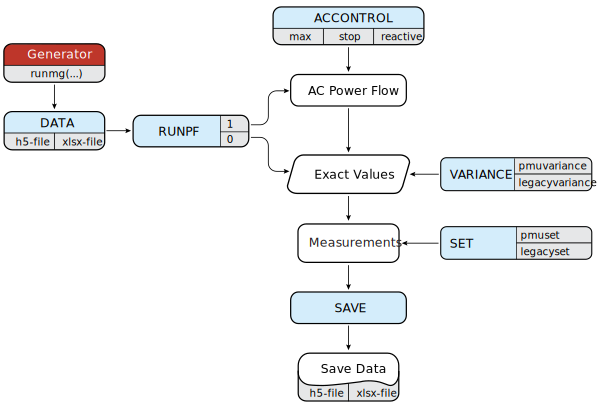

# [Measurement Generator](@id runmg)
The function uses the [AC Power Flow](@ref acpowerflow) or predefined user data to generate measurements ``\{z_1, \dots, z_n\}`` by corrupting the exact solutions ``\{e_1, \dots, e_n\}`` using the additive white Gaussian noise with variances ``\{\sigma_1^{2}, \dots, \sigma_n^{2}\}``:
```math
 z_i = e_i + \epsilon_i  \\[5pt]
 \epsilon_i \sim \mathcal{N}(0,\,\sigma_i^{2}).
```

The standalone measurement generator produces measurement data in a form suitable for the state estimation function.

Also, to achieve global observability of the power system only with PMUs, we implemented the optimal placement algorithm given in [1].

---

## Run Settings
The standalone measurement generator receives inputs for measurement variances, and inputs for measurement sets, to produce measurement data. There are two export formats supported for the measurement data, `.h5` or `.xlsx` file. The settings are provided as input arguments of the function `runmg()`.

The order of inputs and their appearance is arbitrary, with only DATA input required. Still, for the methodological reasons, the syntax examples follow a certain order.

#### Syntax
```julia-repl
runmg(DATA)
runmg(DATA; RUNPF)
runmg(DATA; RUNPF, SET)
runmg(DATA; RUNPF, SET, VARIANCE)
runmg(DATA; RUNPF, SET, VARIANCE, ACCONTROL)
runmg(DATA; RUNPF, SET, VARIANCE, ACCONTROL, SAVE)
```
```@raw html
&nbsp;
```
#### Description
```julia-repl
runmg(DATA) computes the AC power flow problem and generates measurements
runmg(DATA; RUNPF) sets AC power flow analysis
runmg(DATA; RUNPF, SET) defines the measurement set (in-service and out-service)
runmg(DATA; RUNPF, SET, VARIANCE) defines measurement values using predefined variances
runmg(DATA; RUNPF, SET, VARIANCE, ACCONTROL) sets variables for the AC power flow
runmg(DATA; RUNPF, SET, VARIANCE, ACCONTROL, SAVE) exports measurements and power system data
```
```@raw html
&nbsp;
```
#### Output
```julia-repl
measurements, system, info = runmg() returns measurement and power system data with a summary
```
```@raw html
&nbsp;
```
#### Examples
```julia-repl
julia> measurements, system, info = runmg("case14.xlsx"; pmuset = "optimal")
```
```julia-repl
julia> measurements, = runmg("case14.xlsx"; pmuset = ["Iij" 5 "Vi" 2])
```
```julia-repl
julia> measurements, = runmg("case14.xlsx"; pmuset = ["Iij" "all" "Vi" 2], legacyset = ["Pij" 4 "Qi" 8])
```
```julia-repl
julia> measurements, = runmg("case14.h5"; legacyset = ["redundancy" 3.1], legacyvariance = ["complete" 1e-4])
```
```julia-repl
julia> measurements, = runmg("case14.h5"; legacyset = "complete", legacyvariance = ["Pij" 1e-4])
```
---


## Input Arguments
The measurement generator function `runmg()` receives the variable number of argument DATA, and group of arguments by keyword: RUNPF, SET, VARIANCE, ACCONTROL and SAVE.

```@raw html
&nbsp;
```
##### DATA - Variable Argument

| Example           | Description                                    |
|:------------------|:-----------------------------------------------|
|`"case14.h5"`      | loads the power system data from the package   |
|`"case14.xlsx"`    | loads the power system data from the package   |
|`"C:/case14.xlsx"` | loads the power system data from a custom path |

```@raw html
&nbsp;
```
##### RUNPF - Keyword Argument

| Command    | Description                                                                   |
|------------|:------------------------------------------------------------------------------|
|`runpf = 1` | forces the AC power flow analysis to generate measurements, `default setting` |
|`runpf = 0` | generates measurements directly from the input DATA                           |

```@raw html
&nbsp;
```
##### SET - Keyword Argument

| SET:            | Complete Phasor Measurement Set             |
|:----------------|:--------------------------------------------|
| **Command**     | `pmuset = "complete"`                       |                 
| **Description** | complete phasor measurement set in-service  |

| SET:            | Optimal Phasor Measurement Set                                                                                                                             |
|:----------------|:-----------------------------------------------------------------------------------------------------------------------------------------------------------|
| **Command**     | `pmuset = "optimal"`                                                                                                                                       |
| **Description** | deploys phasor measurements according to the optimal PMU location using GLPK solver, where the system is completely observable only by phasor measurements |

| SET:            | Phasor Measurement Set Using Redundancy                                                                     |
|:----------------|:------------------------------------------------------------------------------------------------------------|
| **Command**     | `pmuset = ["redundancy" value]`                                                                             |
| **Description** | deploys random angle and magnitude measurements measured by PMUs according to the corresponding redundancy  |

| SET:            | Phasor Measurement Set According to Devices                                                                                                           |
|:----------------|:------------------------------------------------------------------------------------------------------------------------------------------------------|
| **Command**     | `pmuset = ["device" value]`                                                                                                                           |
| **Description** | deploys voltage and current phasor measurements according to the random selection of PMUs placed on buses, to deploy all devices use `"all"` as value |

| SET:            | Phasor Measurement Set According to Types                                                                                                             |
|:----------------|:------------------------------------------------------------------------------------------------------------------------------------------------------|
| **Command**     | `pmuset = ["Iij" value "Dij" value "Vi" value "Ti" value "complete"]`                                                                                 |
| **Description** | deploys phasor measurements according to the random selection of measurement types[^1], to deploy all selected measurements use `"all"` as value, to deploys all measurements in-service, except for those individually defined use `"complete"` |

```@raw html
&nbsp;
```

| SET:            | Complete Legacy Measurement Set             |
|:----------------|:--------------------------------------------|
| **Command**     | `legacyset = "complete"`                    |                 
| **Description** | complete legacy measurement set in-service  |

| SET:            | Legacy Measurement Set Using Redundancy                                                |
|:----------------|:---------------------------------------------------------------------------------------|
| **Command**     | `legacyset = ["redundancy " value]`                                                    |
| **Description** | deploys random selection of legacy measurements according the corresponding redundancy |

| SET:            | Legacy Measurement Set According to Types                                                                                                             |
|:----------------|:------------------------------------------------------------------------------------------------------------------------------------------------------|
| **Command**     | `legacyset = ["Pij" value "Qij" value "Iij" value "Pi" value "Qi" value "Vi" value "complete"]`                                                       |
| **Description** | deploys legacy measurements according to the random selection of measurement types[^2], to deploy all selected measurements use `"all"` as value, to deploys all measurements in-service, except for those individually defined use `"complete"` |

!!! note "Set"
    If `runpf = 0`, the function keeps sets as in the input DATA and changes only the sets that are called using keywords. For example, if the keywords `pmuset` and `legacyset` are omitted, the function will retain the measurement set as in the input DATA, which allows the same measurement set, while changing the measurement variances.

    If `runpf = 1`, the function starts with all the measurement sets marked as out-service.  

    Further, the function accept any subset of phasor[^1] or legacy[^2] measurements, and consequently, it is not necessary to define attributes for all measurements.  
    ```julia-repl
    julia> runmg("case14.h5"; pmuset = ["Iij" "all" "Vi" 2])
    ```
    Thus, the measurement set will consist of two randomly selected bus voltage magnitude measurements, and all branch current magnitude measurements, both of them related with PMUs.  

```@raw html
&nbsp;
```
##### VARIANCE - Keyword Argument

| VARIANCE:       | Unique Phasor Measurement Variances                       |
|:----------------|:----------------------------------------------------------|
| **Command**     | `pmuvariance = ["complete" value]`                        |                 
| **Description** | applies fixed-value variance over all phasor measurements |

| VARIANCE:       | Random Phasor Measurement Variances within Limits                                         |
|:----------------|:------------------------------------------------------------------------------------------|
| **Command**     | `pmuvariance = ["random" min max]`                                                        |                 
| **Description** | selects variances uniformly at random within limits, applied over all phasor measurements |

| VARIANCE:       | Unique Phasor Measurement Variances According to Types                                                                                                                    |
|:----------------|:--------------------------------------------------------------------------------------------------------------------------------------------------------------------------|
| **Command**     | `pmuvariance = ["Iij" value "Dij" value "Vi" value "Ti" value "complete" value]`                                                                                          |
| **Description** | predefines variances over a given subset of phasor measurements[^1]; to apply fixed-value variance over all, except for those individually defined use `"complete" value` |

```@raw html
&nbsp;
```

| VARIANCE:       | Unique Legacy Measurement Variances                       |
|:----------------|:----------------------------------------------------------|
| **Command**     | `legacyvariance = ["complete" value]`                     |                 
| **Description** | applies fixed-value variance over all legacy measurements |

| VARIANCE:       | Random Legacy Measurement Variances within Limits                                         |
|:----------------|:------------------------------------------------------------------------------------------|
| **Command**     | `legacyvariance = ["random" min max]`                                                     |                 
| **Description** | selects variances uniformly at random within limits, applied over all legacy measurements |

| VARIANCE:       | Unique Legacy Measurement Variances According to Types                                                                                                                    |
|:----------------|:--------------------------------------------------------------------------------------------------------------------------------------------------------------------------|
| **Command**     | `legacyvariance = ["Pij" value "Qij" value "Iij" value "Pi" value "Qi" value "Vi" value "complete" value]`                                                                |
| **Description** | predefines variances over a given subset of legacy measurements[^2], to apply fixed-value variance over all, except for those individually defined use `"complete" value` |

!!! note "Variance"
    If `runpf = 0`, the function keeps measurement values and measurement variances as in the input DATA, and changes only measurement values and variances that are called using keywords. For example, if the keywords `pmuvariance` and `legacyvariance` are omitted, the function will retain the measurement values and variances as in the input DATA, allowing the same measurement values and variances, while changing the measurement sets.

    If `runpf = 1`, the function starts with zero variances, meaning that measurement values are equal to zero values.

    Further, the function accepts any subset of phasor[^1] or legacy[^2] measurements, consequently, it is not necessary to define attributes for all measurements, where keyword `"complete"` generates measurement values according to defined variance for all measurements, except for those individually defined.   
    ```julia-repl
    julia> runmg("case14.h5"; legacyvariance = ["Pij" 1e-4 "complete" 1e-5])
    ```
    The function applies variance value of 1e-5 over all legacy measurements, except for active power flow measurements which have variance equal to 1e-4.

```@raw html
&nbsp;
```
##### ACCONTROL - Keyword Argument

| Command             | Description                                                                             |
|:--------------------|:----------------------------------------------------------------------------------------|
|`max = value`        | specifies the maximum number of iterations for the AC power flow, `default setting: 100`|
|`stop = value`       | specifies the stopping criteria for the AC power flow, `default setting: 1.0e-8`        |
|`reactive = 1`       | forces reactive power constraints, `default setting: 0`                                 |
|`solve = "builtin"`  | built-in linear system solver, `default setting` |
|`solve = "lu"`       | LU linear system solver                                                                 |

```@raw html
&nbsp;
```
##### SAVE - Keyword Argument

| Command                 | Description                    |
|:------------------------|:-------------------------------|
|`save = "path/name.h5"`  | saves results in the h5-file   |
|`save = "path/name.xlsx"`| saves results in the xlsx-file |
---

## Data Structure
The function supports two input types: `.h5` or `.xlsx` file extensions. The measurement data structure consists of variables `pmuVoltage` and `pmuCurrent` associated with phasor measurements, and `legacyFlow`, `legacyCurrent`, `legacyInjection` and `legacyVoltage` associated with legacy measurements. Further, the function requires knowledge about a power system using variables `bus`, `branch`, `generator` and `basePower`.

The minimum amount of information within an instance of the data structure required to run the module requires one variable associated with measurements if `runflow = 0`, and `bus` and `branch` variables.

We advise the reader to read the sections [Power System Data Structure](@ref powersysteminputdata) and [Measurement Data Structure](@ref measurementinputdata) which provides the structure of the DATA.

---

## Flowchart

The measurement generator flowchart depicts the algorithm process according to user settings.



---

### References

[1] B. Gou, “Optimal placement of PMUs by integer linear programming,” IEEE Trans. Power Syst., vol. 23, no. 3, pp. 1525–1526, Aug. 2008.

[^1]: Complete phasor measurement set contains branch current magnitude Iij, branch current angle Dij, bus voltage magnitude Vi and bus voltage angle Ti measurements.
[^2]: Complete legacy measurement set contains active power flow Pij, reactive power flow Qij, branch current magnitude Iij, active power injection Pi, reactive power injection Qi and bus voltage magnitude Vi measurements.
